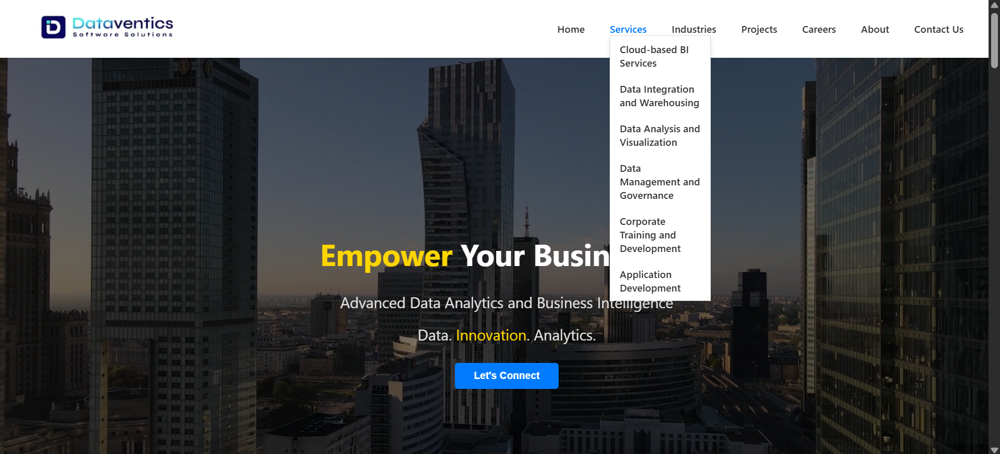

# Dataventics Website Clone

A fully responsive clone of the official [Dataventics](https://www.dataventics.com/) website, built using **ReactJS**. This project was created for learning purposes and showcases modern web development practices using React and modular component design.

## Features

1. Built with ReactJS
2. Fully responsive design (mobile-friendly)
3. Modular component architecture
4. Replicates the design and layout of the original Dataventics site
5. Easy to customize and extend

## Folder Structure

<pre> ```plaintext my-dataventics-dv/ ├── public/ │ ├── project-page-img/ │ ├── tools/ │ ├── icons/ │ └── index.html ├── src/ │ ├── styles/ │ ├── components/ │ ├── pages/ │ │ └── view-job/ │ ├── App.js │ └── index.js ├── .gitignore ├── package.json └── README.md ``` </pre>

## Demo

Live Demo: https://web-application-dv-rakeshs-projects-728b9db3.vercel.app

 

## Tech Stack

- ReactJS (with hooks and functional components)
- CSS3 / SCSS / styled-components (depending on your choice)
- React Router (if applicable)
- Git & GitHub for version control


## Installation & Running Locally


## ⚙️ Installation & Running Locally

bash
# Clone the repository
git clone https://github.com/your-username/dataventics-clone.git

# Navigate into the project directory
cd dataventics-clone

# Install dependencies
npm install

# Start the development server
npm start

License
This project is for educational and personal portfolio use only. All rights to the original website design and branding belong to Dataventics.

Disclaimer: This project is not affiliated with or endorsed by Dataventics. It's a non-commercial clone built for learning and portfolio purposes.

